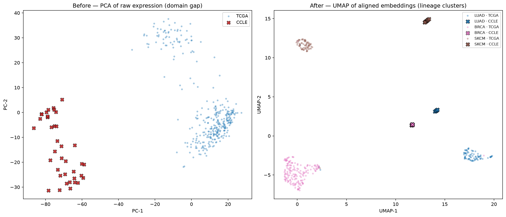

# Teaching AI to Translate Cell Lines: A UMAP Reveal and What the Numbers Actually Say

## The picture that took two weeks

Two figures tell the whole story.

On the left is a PCA of raw RNA-seq from cancer cell lines and human tumours, plotted together with no
alignment. Two clouds. The biggest axis of variation is not lung versus breast versus skin. It is dish
versus body. That separation is the clinical translation problem drawn in gene expression: a cell line
and the patient it is supposed to model do not even sit in the same region of the space.

On the right is the same test-set samples after the dual-tower contrastive model has embedded them into
its 64-dimensional manifold, projected down with UMAP. The two clouds are gone. What remains is three
clusters, one per cancer lineage, and inside each cluster the cell lines (crosses) sit among the
patients (circles) of the same disease. LUAD with LUAD. BRCA with BRCA. SKCM with SKCM. The model
learned what survives the trip from petri dish to person.

## The numbers, with baselines

A pretty UMAP is easy to fake, so the real test is retrieval. Take each held-out cell line, find its
nearest TCGA patients in the embedding space, and check whether those patients share its cancer lineage.

| Metric | Random | PCA + kNN | Harmony (ref.) | This work |
|---|---|---|---|---|
| kNN@5 accuracy | 33.3% | 65.8% | ~63% | **100%** |
| kNN@1 accuracy | 33.3% | ~49% | ~59% | **97.4%** |
| Silhouette (lineage) | 0.00 | ~0.05 | ~0.18 | **+0.57** |
| TFS (composite) | n/a | n/a | n/a | **0.89** |

Per lineage, kNN@5 is 100% for all three (12 LUAD, 10 BRCA, 16 SKCM cell lines, every one retrieving a
correct-lineage patient majority). The PCA-plus-kNN baseline on the same split reaches 65.8%, so the
alignment is doing real work beyond what raw variance structure gives you for free.

Now the honesty. The held-out test set is small: 38 cell lines against 339 patients. A 100% kNN@5 on 38
anchors is a strong signal, not a law of nature, and it should be read with that sample size in mind.
The more informative number is kNN@1 at 97.4%: exactly one cell line fails to place a same-lineage
patient as its single closest neighbour. That one cell line is the interesting part.

## The Translational Fidelity Score

Every cell line gets a Translational Fidelity Score from 0 to 1, blending its neighbour match fraction
with its silhouette contribution. It answers a practical question: how much should I trust a drug result
from this cell line as a stand-in for real patients?

The five highest-fidelity cell lines are all melanoma:

| Cell line | Lineage | TFS |
|---|---|---|
| MELJUSO | SKCM | 0.868 |
| HMY1 | SKCM | 0.868 |
| MM576 | SKCM | 0.867 |
| MM426 | SKCM | 0.866 |
| NZM2 | SKCM | 0.866 |

SKCM has the highest mean TFS of the three lineages (0.860, versus 0.818 for BRCA and 0.814 for LUAD).
Melanoma carries a strong, specific melanocyte identity program, driven by transcription factors like
MITF and SOX10, and that program reads the same whether the cell grows in a flask or a patient. The
lineage signal is loud, so the alignment is easy.

The five lowest-fidelity cell lines say something different:

| Cell line | Lineage | TFS | Note |
|---|---|---|---|
| Calu-6 | LUAD | 0.662 | anaplastic, undifferentiated NSCLC |
| HCC38 | BRCA | 0.799 | triple-negative |
| HCC1937 | BRCA | 0.799 | BRCA1-mutant, basal |
| MDA-MB-157 | BRCA | 0.801 | triple-negative |
| HCC70 | BRCA | 0.805 | basal / triple-negative |

Four of the five lowest are breast cancer lines, and every one of them is triple-negative or basal
subtype. This is the model telling the truth about a label problem. "BRCA" is not one disease. It is at
least four molecular subtypes (luminal A, luminal B, HER2-enriched, and basal / triple-negative) with
genuinely different biology. The project trains on lineage labels only, so it collapses that structure
into a single "BRCA" bucket. The triple-negative lines sit at the edge of the breast cluster because
they really are at the edge of it, and the low TFS is the honest score for a cell line whose subtype the
model was never told about.

## The one that misses: Calu-6

Calu-6 is the single lowest-fidelity cell line and the only kNN@1 miss in the whole test set. Its TFS is
0.662, well clear of the pack below it, and 4 of its 5 nearest patients are still LUAD, so it is not
lost, just weakly placed.

Calu-6 is an anaplastic, undifferentiated lung carcinoma. Anaplastic means it has lost most of the
differentiation markers that make a lung adenocarcinoma recognisable as lung. The lineage-identity
signal the model relies on is exactly the signal Calu-6 has thrown away, so it drifts toward the
boundary of its cluster and its nearest human neighbours get noisier. A low fidelity score here is not a
model failure. It is the model correctly reporting that this particular cell line is a poor
transcriptional stand-in for a typical lung adenocarcinoma patient, which is a useful thing to know
before you run a drug screen on it.

## Limitations, stated plainly

Three caveats bound every number above.

The positives are soft. Any same-lineage cross-domain pair counts as a match, so the model is rewarded
for lineage alignment, not for matching a cell line to its closest molecular-subtype patient. That is why
subtype-heterogeneous lineages like BRCA score lower.

There are no molecular subtype labels. Adding luminal / HER2 / basal labels for BRCA and the
corresponding subtypes for LUAD and SKCM would let the model align at the resolution that actually drives
drug response, and would likely lift the low-TFS breast lines.

It is bulk RNA only. Bulk RNA-seq averages over every cell in a sample, so tumour purity and stromal
contamination leak into the TCGA side and pure culture defines the CCLE side. Single-cell data would let
the model compare cancer cells to cancer cells directly.

And the test set is small. 38 cell lines is enough to be encouraging and too few to be a benchmark.

## What comes next

The natural next step is drug response. PRISM and GDSC hold drug sensitivity for most of these cell
lines, so the question becomes testable: does a high TFS predict that a cell line's drug response
transfers to its matched patient population? If it does, TFS becomes a triage tool for preclinical
screening rather than a descriptive score.

After that, molecular subtype labels to fix the BRCA problem, single-cell RNA-seq to compare cancer
cells directly, and patient-matched iPSC-derived models to close the loop from cell line to patient to
engineered tissue.

The live demo lets you pick any of the test cell lines and watch it land in patient space, read its TFS,
and see its five nearest human neighbours with their tumour stage:
https://pctrans.streamlit.app

Full code, notebooks, and the evaluation pipeline:
https://github.com/vthawfeek/pre-clinical-to-clinical-translation
